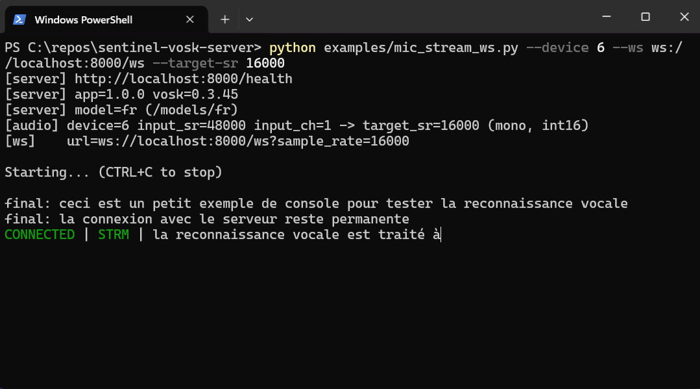

# sentinel-vosk-server

FastAPI-based Speech-to-Text server using Vosk, exposing both HTTP (Swagger/OpenAPI) and WebSocket streaming on a single port.

Models are NOT included in this repository. You must mount a Vosk model directory at runtime.

---

## Features

- HTTP API for WAV transcription
- WebSocket streaming for real-time STT
- Swagger UI available at /docs
- Single container, single port
- Model path fully configurable via environment variables (no hardcoded language)

---

## Examples (client scripts)

This repository includes ready-to-run client examples in the `examples/` folder.

Notably, it provides a **console microphone streaming client** that can stream audio continuously to the server WebSocket endpoint and display:
- connection status (connecting / connected / connection failed)
- live partial transcription
- final transcription segments




See `examples/README.md` for setup and usage commands (Windows + Linux), including URL examples.


## Quickstart (Docker Compose)

1) Put your Vosk models in a local folder, for example:

./models/
  fr/
  en/

2) Create a .env file:

VOSK_MODEL=fr

3) Start:

docker compose up --build

Open:
- Swagger: http://localhost:8000/docs
- Health:  http://localhost:8000/health

---

## Configuration

### Required (choose ONE approach)

Option A (absolute path):
- VOSK_MODEL_PATH=/models/<model_folder>

Option B (recommended):
- VOSK_MODELS_DIR=/models
- VOSK_MODEL=<model_folder>

### Optional
- PORT (default: 8000)
- VOSK_SAMPLE_RATE (default: 16000) — used for WebSocket if query param not provided

---

## API

### Health
GET /health

Returns status and Vosk informations.

### HTTP transcription (WAV upload)
POST /api/transcribe

- Accepts: WAV container, 16-bit PCM (mono or stereo)
- Recommended: 16 kHz mono 16-bit PCM WAV
- No resampling is performed.

Example:

curl -X POST "http://localhost:8000/api/transcribe" -F "file=@sample.wav"

### WebSocket streaming
GET /ws?sample_rate=16000

Protocol:
- Client sends binary frames: PCM S16LE mono at sample_rate
- Server sends JSON text frames:
  - {"type":"partial","text":"..."}
  - {"type":"final","text":"...","result":[...]}

Example (convert mic audio to 16kHz PCM S16LE mono):

ffmpeg -f alsa -i default -ac 1 -ar 16000 -f s16le pipe:1

Your client must read the PCM bytes and push them to the WebSocket as binary messages.

---

## Local development

python -m venv .venv
source .venv/bin/activate
pip install -r requirements.txt

export VOSK_MODELS_DIR=/abs/path/to/models
export VOSK_MODEL=fr

uvicorn app.main:app --host 0.0.0.0 --port 8000

---

## Run (Docker)

### Build & run
```bash
docker compose up --build
```

Then open:
- Swagger: `http://localhost:8000/docs`

---

## Releases & Docker image publishing (GHCR)

This repo includes a GitHub Actions workflow that builds and publishes a **multi-arch** image to **GitHub Container Registry (GHCR)** and **Docker Hub[^1]** when you push a git tag like `v1.0.0`.

Example:
```bash
git tag v1.0.0
git push origin v1.0.0
```

The image will be published as:
- `https://ghcr.io/<your-github-username>/sentinel-vosk-server:1.0.0`
- `https://hub.docker.com/r/<your-docker-hub-username>/sentinel-vosk-server`

By design, there is **no** `latest` tag.

[^1]: see [GitHub Actions secrets](https://docs.github.com/fr/actions/how-tos/write-workflows/choose-what-workflows-do/use-secrets) on your repository settings if you want to publish on Docker Hub.
---

## License

MIT — see LICENSE.

## Third-party notices

This project bundles third-party components. See THIRD_PARTY_NOTICES.md.